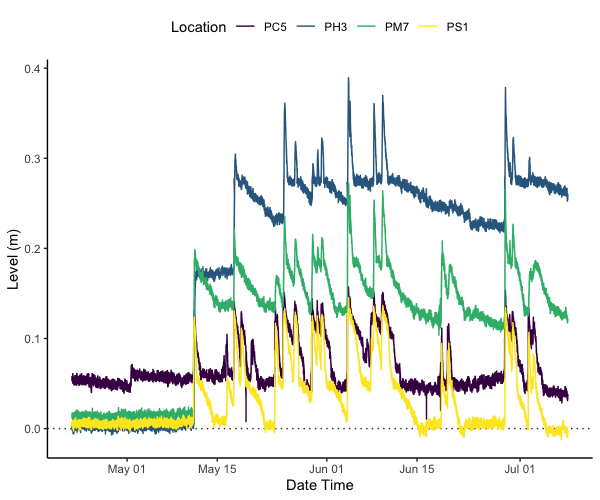

# Troll_Extract

Using a folder with BaroTroll data and a folder with RuggedTroll data, get barometrically corrected level data from the exported .zip files using 

```
Level_data <- Troll_Extract(Baro_folder = "Example_data/Zip/Baro", 
                              Level_folder = "Example_data/Zip/Level",
                              corrections_csv = "Example_data/priddo_corrections.csv")
```

Calculate the Water Table Depth using the corrected data. Note: this may remove the last three datapoints from each file, as when the loggers are stopped, a flag is added to the bottom of the csv... which is kind of annoying and messes up the whole function... so being lazy, I've just default assumed it's there and that others will download an overlap of data worse case / downloading normally results in some data loss anyway.

```
WTD_data <- Calc_WTD(the_data = Level_data,
                       corrections_csv = "Example_data/priddo_corrections.csv")
```


* Troll_Functions.R contains the functions
* Working_Example.R is a working example demonstrating how it can be implemented


To Do:
[ ] Change main function to have "corrections" as an optional feature
[ ] Gap filling for missing data
[ ] Function for stilling well applications
[ ] Make the whole thing into more of a package-like set-up as we will be using this on multiple projects...
[ ] If using as package - make option for removing last three lines (as with Jo's files)

### Example Level Data


### Example WTD Data
